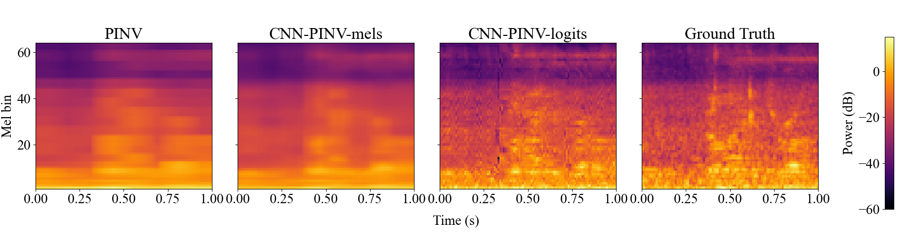
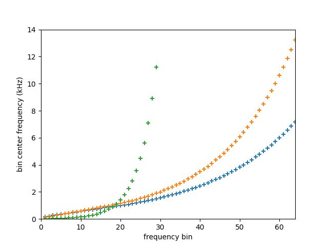
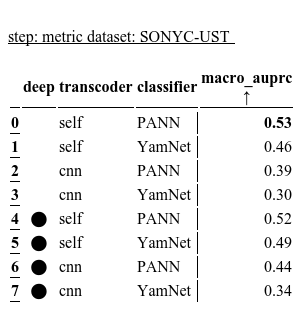
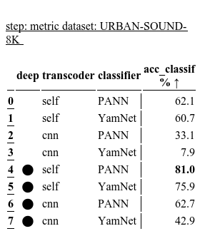

# Spectral Transcoder : Using Pretrained Urban Sound Classifiers On Arbitrary Spectral Representations

This repo contains code for the paper: **Spectral Transcoder : Using Pretrained Urban Sound Classifiers On Undersampled Spectral Representations** [1]. It uses YAMNet [2] and PANN [3] pre-trained models in a teacher student approach to transcode 125ms third-octave spectrogral representations into 32ms Mel representations. Results of the paper can be reproduced looking at section 2. Some audio samples can be generated looking at section 3. Some complementary experiment results are in section 4. 

## 1 - Setup Instructions

The codebase is developed with Python 3.9.15. To install the required dependencies, run the following command:
```
pip install -r requirements.txt
```

Additionally, download the pretrained models (PANN ResNet38 and Efficient Nets) by executing the following command:
```
python3 download_pretrained_models.py
```

If you want to replicate paper results, you can download the required datasets, namely the [TAU Urban Acoustic Scenes 2020 Mobile](https://dcase.community/challenge2021/task-acoustic-scene-classification), [UrbanSound8k](https://urbansounddataset.weebly.com/urbansound8k.html), and [SONYC-UST](https://zenodo.org/record/3966543#.ZFtddpHP1kg) datasets using the following commands:

```
python3 download_datasets.py
```

It is crucial to download the datasets using this command, as the names and metadata files of the datasets have been slightly modified (correcting the duration calculation issue in the original dataset). The datasets will be added to the root of the folder. If you want to specify a different path for the datasets (e.g. `mypath`), use the following command:

```
python3 download_datasets.py --output mypath
```

Please make sure that you have around 150G of free space in your hard disk to have enough space for the datasets and for running the experiments.

## 2 - Replication of paper results

### a) Experiment: training models

To generate third-octave and Mel data from the [TAU Urban Acoustic Scenes 2020 Mobile](https://dcase.community/challenge2021/task-acoustic-scene-classification), which will be used to train and evaluate the models in the subsequent sections, execute the following command:

```
python3 exp_train_model/create_mel_tho_dataset.py
```

By default, the data will be stored in the root of the GitHub folder. If you prefer to store the data in a different location (e.g., `mypath`), use the following command:

```
python3 exp_train_model/create_mel_tho_dataset.py --output_path mypath
```

The experiment plan is developped with [doce](https://doce.readthedocs.io/en/latest/). 
To reproduce only the results shown in the paper, use the following commands (requires approximately 50h of calculation on a single GPU V100):

```
python3 exp_train_model/launch_experiment/launch_exp_py.py --exp_type restricted
```

To reproduce detailed results, with a comparison between different hyperparameters, use the following commands (requires approximately 300h of calculation on a single GPU V100):

```
python3 exp_train_model/launch_experiment/launch_exp_py.py --exp_type detailed
```

Alternatively, you can launch the experiment using slurms (to run the code on the [jean zay server](http://www.idris.fr/jean-zay/jean-zay-presentation.html)). First, create your slurms by executing the following command:

```
python3 exp_train_model/launch_experiment/slurms_create.py
```

Then, launch the reference experiment using the following command:

```
python3 exp_train_model/launch_experiment/jean_zay_slurm_reference.slurm
```

Wait until the reference plan of the experiment is finished. Afterward, you can launch all the slurm files on different GPUs using the following command (about 20h of calculation on multiple GPU V100):

```
python3 exp_train_model/launch_experiment/launch_exp_slurms.py
```

You can then export the results in a png format in the `results` folder using the following commands:

```
python3 exp_train_model/export_experiment_results.py 
```

The results will show in folder `export` and will be named `results_training_PANN.png` and `results_training_YamNet.png`

If you want to show more detailed results, please read [doce tutorial](https://doce.readthedocs.io/en/latest/tutorial.html), and select 
the plan and the parameters you want to show. Here is a command example,
which will create an export file `myresults.png` in the `export` folder:

```
python3 exp_train_model/main_doce_training.py -s cnn/dataset=full+classifier=PANN -d -e myresults.png
```

To plot the training curve of the trained CNN-logits model (feel free to change source code if you want any other model) used in the paper, execute the 
following command:

```
python3 exp_train_model/plot_training_curve.py
```


### b) Experiment: Evaluate models on classification datasets

Generate the logit data (classes predictions) from the classifiers and the transcoded classifiers on the datasets [UrbanSound8k](https://urbansounddataset.weebly.com/urbansound8k.html) and [SONYC-UST](https://zenodo.org/record/3966543#.ZFtddpHP1kg) using the following commands:

```
python3 exp_classif_eval/create_logit_dataset.py --audio_dataset_name URBAN-SOUND-8K
python3 exp_classif_eval/create_logit_dataset.py --audio_dataset_name SONYC-UST
```

The models used for this experiment are in the folder `reference_models`. To launch the experiment and train the additional fully connected layers, execute the following commands:

First command to execute:
```
python3 exp_classif_eval/main_doce_score.py -s reference/ -c
```

Second command to execute:
```
python3 exp_classif_eval/main_doce_score.py -s deep/ -c
```

Then, you can export the results of the experiment ("results_classif_urbansound8k.png", "results_classif_sonycust.png") in a png format in the `export` folder using the following commands:

```
python3 exp_classif_eval/main_doce_score.py -s deep/dataset=URBAN-SOUND-8K -d [0] -e results_classif_urbansound8k.png
python3 exp_classif_eval/main_doce_score.py -s deep/dataset=SONYC-UST -d [1] -e results_classif_sonycust.png
```


## 3 - Audio generation

As Mel spectrograms can be inverted with librosa using the feature [mel_to_audio](https://librosa.org/doc/main/generated/librosa.feature.inverse.mel_to_audio.html), we can also invert transcoded Mel spectrograms and thus retrieve audio from third-octave spectrograms. You can try with your own audio files, by putting your wav file (`myfile.wav`) in the audio folder and executing this command:

```
python3 generate_audio.py myfile.wav
```

The generated wav files will be placed in the `audio_generated/myfile` folder. It will contain the normalized original file (`myfile_original.wav`) and the audio file generated from PANN 32ms Mel Spectrogram (`myfile_generated_from_groundtruth_mel.wav`). The folder will also contain the files generated from 125ms third-octave spectrograms transcoded into 32-ms Mel spectrograms, with the different transcoding techniques mentioned in the paper: the audio file generated from the PINV transcoder (`myfile_generated_from_pinv.wav`), the audio file generated from the CNN-mels transcoder(`myfile_generated_from_cnn_mels.wav`) and finally, the audio file generated from the CNN-logits transcoder (`myfile_generated_from_cnn_logits.wav`).

An audio example obtained on [freesound](https://freesound.org/) have been re-generated with this algorithm and is available in the `audio` and `audio_generated` folders. The file is named "birds.wav" (obtained from: [https://freesound.org/people/hargissssound/sounds/345851/](https://freesound.org/people/hargissssound/sounds/345851/)). Interestingly, the audio files sounds quite realistic when the transcoder CNN-logits is used. Here are the generated audios from "birds.wav":

| Italic             |  Block letters |
:-------------------------:|:-------------------------:
  |  
  |  
  |  

Original audio file

https://github.com/modantailleur/paperSpectralTranscoder/assets/110234188/828a44c2-88ac-4a45-bca8-b45e712a49dc


Audio generated from Mel spectrogram (ground truth)

https://github.com/modantailleur/paperSpectralTranscoder/assets/110234188/cb6604a2-dc21-4d14-872b-4aaccda0e505


Audio generated from transcoded Mel spectrogram (PINV)

https://github.com/modantailleur/paperSpectralTranscoder/assets/110234188/ff9b3756-5016-4314-968c-629204548bce


Audio generated from transcoded Mel spectrogram (CNN-mels)

https://github.com/modantailleur/paperSpectralTranscoder/assets/110234188/e2b38f4c-d88a-4eb5-8f23-cab61517fef0


Audio generated from transcoded Mel spectrogram (CNN-logits)

https://github.com/modantailleur/paperSpectralTranscoder/assets/110234188/21552f3b-79e2-4a7a-88ba-00682fdc6553


## 4 - Complementary experiment results

The figure below (run `plot_spectro_dcase2023.py` to replicate the figure) demonstrates the results of the transcoding process using various transcoding algorithms, namely the PINV transcoder, CNN-mels transcoder, and CNN-logits transcoder, on a 1-second audio excerpt from the evaluation dataset.



The ability to easily transcode Mel spectrograms into third-octave spectrograms would have been advantageous for training deep learning models, facilitating approaches such as auto-encoding. However, this task is not straightforward, despite the presence of more Mel bins in Mel spectrograms. The following figures (run `plot_thirdo_mels_bands_repartition.py` to replicate the figure) illustrate the distribution of Mel spectral bands and third-octave bands along the frequency axis. It is observed that there are more third-octave bands in the lower frequencies (below 1kHz) compared to Mel bands, making the transcoding of Mels to third-octaves, especially in that part of the spectrum, challenging.



In our paper titled "Spectral Transcoder: Using Pretrained Urban Sound Classifiers on Undersampled Spectral Representations," we propose a revised version of the aggregation method introduced by F. Gontier et al. [4]. During the inference process, we group some of the classes that are considered relevant for each SONYC-UST and UrbanSound8k class. The groups used during inference can be found in the files `exp_classif_eval/sub_classes_sonyc_ust.xlsx` and `exp_classif_eval/sub_classes_urbansound8k.xlsx`.

In Gontier et al. 's paper, if in the highest top 3 predictions of YamNet one predicted class among the 527 belongs to one of the meta-classes (traffic, voice, birds in their paper), the meta-class was considered present. Instead of taking the top 3, the top 8 classes of SONYC-UST is taken into account for the aggregation. In our case, we believe that Gontier et al.'s method can result in some false negatives for multi-label classification. For example, if there are is some music in the audio excerpt, it is very likely that the 8 first predicted classes will be related to music (ex: 1:Music, 2:Musical Instrument, 3:Guitar, 4:Pop Music, 5:Drum, 6:Piano, 7:Bass Guitar, 8:Acoustic Guitar), and so the next prediction at position 9 will not be considered present in the audio excerpt (ex: 9: Speech). To address this issue, we propose grouping classes during inference, which reduces false negatives (e.g., 1: SONYC-UST Music, 2: SONYC-UST HumanVoice, 3: Mosquito, etc.). This aggregation approach leads to a higher mAUC than Gontier et al.'s method for SONYC-UST. A similar type of aggregation is employed for UrbanSound8k but in a simpler multi-class classification paradigm (the meta-class is considered present if one of its classes has the highest score). 

The results of this method, compared to the method where we add fully connected layers at the output of the pre-trained models (as explained in the paper), are presented in the tables below. When the "deep" parameter is set to 1, fully connected layers are used. Conversely, when "deep" is set to 0, the aggregation method described in the previous paragraph is employed.




The images above can be replicated using the following commands (after running part 2-b):

```
python3 exp_classif_eval/main_doce_score.py -s "{'dataset':'URBAN-SOUND-8K'}" -d [0] -e results_classif_urbansound8k.png
python3 exp_classif_eval/main_doce_score.py -s "{'dataset':'SONYC-UST'}" -d [1] -e results_classif_sonycust.png
```

## REFERENCES

[1] link to our paper

[2] Tensorflow, “Sound classification with yamnet,” 2020, last
access on 09/05/2023. [Online]. Source Code: [https://github.com/tensorflow/models/tree/master/research/audioset/yamnet/](https://github.com/tensorflow/models/tree/master/research/audioset/yamnet/).

[3] Q. Kong, Y. Cao, T. Iqbal, Y. Wang, W. Wang, and M. D.
Plumbley, “Panns: Large-scale pretrained audio neural net-
works for audio pattern recognition,” IEEE/ACM Transac-
tions on Audio, Speech, and Language Processing, vol. 28,
pp. 2880–2894, 2020, publisher: IEEE. Source Code: [https://github.com/qiuqiangkong/audioset_tagging_cnn](https://github.com/qiuqiangkong/audioset_tagging_cnn). Available: [https://arxiv.org/abs/1912.10211](https://arxiv.org/abs/1912.10211).

[4] F. Gontier, V. Lostanlen, M. Lagrange, N. Fortin, C. La-
vandier, and J.-F. Petiot, “Polyphonic training set synthe-
sis improves self-supervised urban sound classification,” The
Journal of the Acoustical Society of America, vol. 149, no. 6,
pp. 4309–4326, 2021, publisher: Acoustical Society of Amer-
ica. Available: [https://hal-nantes-universite.archives-ouvertes.fr/hal-03262863/](https://hal-nantes-universite.archives-ouvertes.fr/hal-03262863/).

## DEPENDENCIES

This repo contains a `yamnet` folder which is a pytorch port of the original YAMNet ([link](https://github.com/w-hc/torch_audioset)). It also contains a `pann` folder which is the original PANN repository ([link](https://github.com/qiuqiangkong/audioset_tagging_cnn)). We have extended the source codes with supplementary functionalities that are significant for our research.

The `doce` folder of this repo contains the source code from the [doce project](https://doce.readthedocs.io/en/latest/) (downloaded the 31/05/2023). As this project is still in progress, doce is not present in the `requirements.txt` file, in order to ensure the reproductibility of the results.
